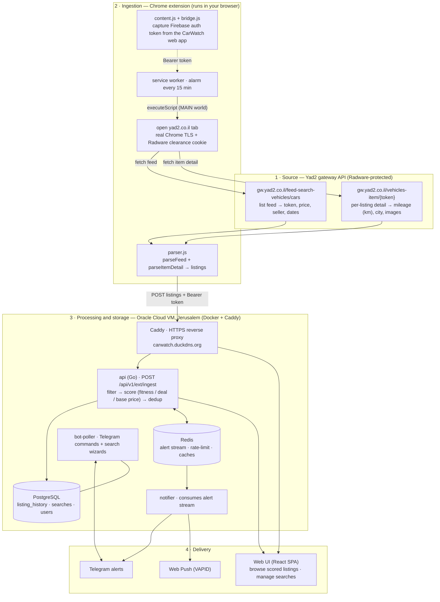

# CarWatch

A self-hosted bot that monitors Israeli car listing sites (Yad2) and sends notifications when new listings match your search criteria.

## What it does

1. Ingests Yad2 car listings via a browser extension that calls Yad2's own
   gateway JSON API from a real browser tab (see [Data flow](#data-flow))
2. Filters results by engine size, mileage, ownership count, keywords
3. Deduplicates using PostgreSQL so you only get notified once per listing
4. Serves a web UI to browse scored listings, and sends formatted
   notifications (specs, price, direct link) via Telegram and Web Push

## Quick start

```bash
cp config.example.yaml config.yaml
# Edit config.yaml with your Telegram bot token and PostgreSQL DSN

make build
./bot -config config.yaml
```

### Docker

```bash
docker compose -f docker-compose.prod.yaml up -d
```

For production compose, set `REDIS_PASSWORD` in `.env` and configure Redis in `config.yaml`:

```yaml
redis:
  addr: "redis:6379"
  password: "${REDIS_PASSWORD}"
  db: 0
```

Also set `TELEMETRY_AUTH_TOKEN` in `.env` and configure:

```yaml
telemetry:
  auth_token: "${TELEMETRY_AUTH_TOKEN}"
```

This token protects `/metrics` when binding the API on a non-localhost address.
`POST /api/v1/vitals` uses normal API authentication (Firebase in production, `api.auth_token` in local dev mode).

Set an immutable application image tag in `.env` and use release tags for deploys:

```dotenv
CARWATCH_IMAGE_TAG=9.16.11
```

### Production deploy verification

After deployment, verify every runtime service is healthy:

```bash
docker exec carwatch-api wget -q --spider http://localhost:8080/healthz
docker exec carwatch-bot-poller wget -q --spider http://localhost:8082/healthz
docker exec carwatch-scraper wget -q --spider http://localhost:8081/healthz
docker exec carwatch-notifier wget -q --spider http://localhost:8083/healthz
docker exec carwatch-enricher wget -q --spider http://localhost:8084/healthz
```

If any check fails, rollback deterministically to the last known-good image tag:

```bash
cd ~/carwatch
set -a; source .env; set +a
PREV_TAG=$(cat prev_image_tag)
if grep -q '^CARWATCH_IMAGE_TAG=' .env; then
  sed -i "s/^CARWATCH_IMAGE_TAG=.*/CARWATCH_IMAGE_TAG=${PREV_TAG}/" .env
else
  echo "CARWATCH_IMAGE_TAG=${PREV_TAG}" >> .env
fi
CARWATCH_IMAGE_TAG="${PREV_TAG}" docker compose -f docker-compose.prod.yaml pull postgres redis api bot-poller scraper notifier enricher
CARWATCH_IMAGE_TAG="${PREV_TAG}" docker compose -f docker-compose.prod.yaml up -d postgres redis api bot-poller scraper notifier enricher

# verify rollback health
docker exec carwatch-api wget -q --spider http://localhost:8080/healthz
docker exec carwatch-bot-poller wget -q --spider http://localhost:8082/healthz
docker exec carwatch-scraper wget -q --spider http://localhost:8081/healthz
docker exec carwatch-notifier wget -q --spider http://localhost:8083/healthz
docker exec carwatch-enricher wget -q --spider http://localhost:8084/healthz
```

## Configuration

See [`config.example.yaml`](config.example.yaml) for all options.

## Data flow

Where the data comes from, where it's processed and stored, and how it reaches
you. Yad2 now serves listings from a Radware-protected gateway JSON API and no
longer embeds them in server-rendered HTML, so a **browser extension** running
in your own Chrome is the ingestion engine: it calls Yad2's gateway API from a
real tab (carrying the browser's TLS fingerprint and Radware clearance cookie),
which server-side scrapers can no longer do.



**Stages**

1. **Source** — Yad2's gateway API. The list feed gives one row per listing;
   most rows omit mileage, so each is enriched with a per-item detail call.
2. **Ingestion** — the extension's service worker wakes every 15 min, fetches
   the feed + item details from an open Yad2 tab, parses them, and `POST`s the
   listings to the API authenticated with a Firebase token it captured from the
   CarWatch web app. (This replaced the old server-side `scraper`/`enricher`
   containers, which Radware now blocks; they are stopped.)
3. **Processing & storage** — `POST /api/v1/ext/ingest` runs each active search's
   filter, scores every match (fitness, deal vs. market median, catalog base
   price), deduplicates, and writes to PostgreSQL. Redis backs the alert stream,
   rate limiting, and caches.
4. **Delivery** — the **web UI** reads listings straight from PostgreSQL (works
   today). **Telegram / Web Push** alerts are emitted by the `notifier`, which
   consumes the Redis **alert stream**.

> **Note — alerts vs. web UI.** The alert stream is currently published only by
> the scheduler that drove the old `scraper` (now stopped). The extension's
> ingest path saves listings (so the **web UI is live**) but does **not** yet
> publish to the alert stream, so Telegram/Push alerts won't fire from it until
> `POST /api/v1/ext/ingest` is wired to publish new matches. That is the one
> remaining piece for full parity.

See [docs/architecture.md](docs/architecture.md) for the full component
breakdown. All components communicate through interfaces, making each layer
independently testable and swappable.

## Project structure

```
carwatch/
├── cmd/bot/main.go              # Entry point, wiring
├── internal/
│   ├── api/                     # REST API (listings, searches, bookmarks)
│   ├── bot/                     # Telegram bot handlers, wizards, callbacks
│   ├── catalog/                 # Dynamic car catalog (make/model/submodel)
│   ├── config/                  # YAML loading, validation, defaults
│   ├── fetcher/                 # Fetcher interface + circuit breaker, caching
│   │   └── yad2/                # Yad2 adapter (client, parser, fetcher)
│   ├── filter/                  # Stateless listing filter
│   ├── format/                  # Number/price formatting
│   ├── health/                  # Health check handler
│   ├── locale/                  # Hebrew locale strings
│   ├── model/                   # RawListing, Listing
│   ├── notifier/                # Multi-notifier dispatch
│   │   ├── telegram/            # Telegram adapter
│   │   └── webpush/             # WebPush adapter (VAPID)
│   ├── pricelist/               # Vehicle base price lookup
│   ├── scheduler/               # Polling loop, retry, backoff, pipeline
│   ├── scoring/                 # Market analysis, fitness & deal scoring
│   ├── spa/                     # SPA file server (serves web/dist)
│   └── storage/                 # Store interfaces
│       └── postgres/            # PostgreSQL adapter
├── web/                         # React/Vite/TypeScript frontend (SPA)
│   ├── src/pages/               # Login, Listings, Searches, Saved, Admin...
│   └── public/                  # Icons, manifest
├── migrations/                  # PostgreSQL schema migrations
├── docs/                        # Architecture & design docs
├── config.example.yaml
├── Dockerfile                   # Multi-stage: frontend build -> Go build -> runtime
├── docker-compose.dev.yaml      # Local development
├── docker-compose.prod.yaml     # Production (carwatch + Caddy + PostgreSQL)
└── Makefile                     # Build, test, lint, VM management
```

## Development

### Local setup

Prerequisites: Go 1.25+, Docker (for PostgreSQL).

```bash
make dev-db        # Start PostgreSQL via Docker
make dev           # Build + run with local PostgreSQL
make dev-stop      # Stop PostgreSQL
make dev-reset     # Wipe database and start fresh
make dev-pg-shell  # Open psql shell to local database
```

Set `TELEGRAM_BOT_TOKEN` in your environment before running `make dev`.

### Testing

```bash
make test          # Run tests with coverage
make lint          # Run golangci-lint
make ci            # Lint + test (what CI runs)
make test-cover    # Generate HTML coverage report
```

## License

Private project.
