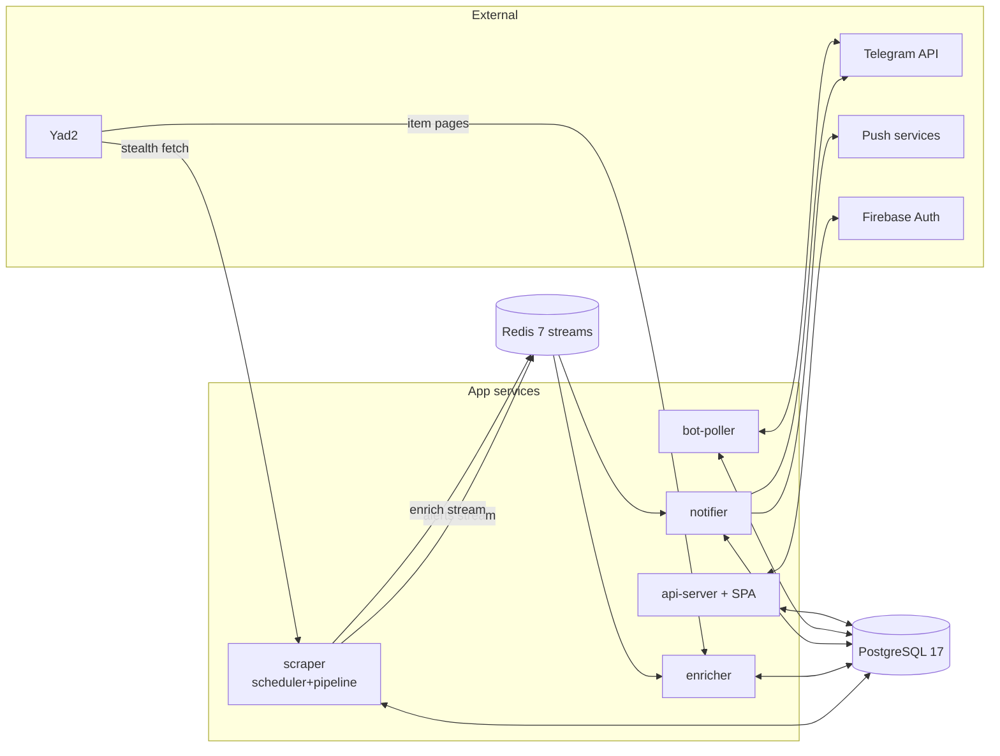

# CarWatch Engineering Audit — June 2026

**Scope:** full repository (Go backend ~41K LOC across 205 files, React SPA ~135 TS/TSX files, 22 migrations, CI/CD, deployment).
**Method:** three independent exploration passes, followed by a file-level verification pass in which every candidate finding was re-read in code. Findings that could not be confirmed with `file:line` evidence were discarded (five candidates were falsified outright — see the falsified-candidates table in [02-findings.md](02-findings.md)).
**Companions:** [02-findings.md](02-findings.md) (verified findings register), [03-product-ux-review.md](03-product-ux-review.md), [04-testing-strategy.md](04-testing-strategy.md), [05-tech-debt-register.md](05-tech-debt-register.md), [06-roadmap.md](06-roadmap.md).

---

## 1. Product overview

CarWatch is a self-hosted aggregator for the Israeli used-car market (Yad2). Users define vehicle searches (manufacturer, model, year/price/km/hand ranges, gearbox, seller type, keywords) through either a Telegram bot wizard or a React web app. The system polls Yad2 on a jittered ~15-minute cycle during active hours (08:00–22:00 Asia/Jerusalem), deduplicates listings per user per search, scores each match (fitness vs. the user's bounds; deal score vs. a market cohort of comparable cars), and pushes notifications via Telegram and Web Push. Listings are enriched asynchronously (km, city, image from the item detail page), price history is tracked for drop alerts and trend charts, and an admin dashboard exposes metrics, cycle stats, and live log streaming.

**Users:** the operator's own circle — Telegram-first users, web users (Firebase auth, with Telegram↔web account linking), and one admin. This is a personal-scale production system, not a multi-tenant SaaS, and several architecture judgments below are calibrated to that reality.

## 2. Architecture overview

Five deployable services share one image (`Dockerfile`, multi-stage Node→Go→Alpine), composed in `docker-compose.prod.yaml` behind Caddy (TLS):

- **Fetch chain** (`internal/fetcher/`): CircuitBreaker (5 failures → 10 min cooldown) → CachingFetcher (5 min TTL) → PaginatingFetcher → Yad2Fetcher (azuretls stealth client: TLS fingerprint mimicry, UA rotation, optional SOCKS5 proxies, ordered browser headers). Sentinel errors (`ErrChallenge`, `ErrRateLimited`) drive an adaptive backoff multiplier (×2 up to ×4 on challenge, halves on success).
- **Scheduler** (`internal/scheduler/`): one global feed fetch per cycle, percolated against all active searches (`percolator`), per-user/per-search dedup via `seen_listings` `INSERT … ON CONFLICT DO NOTHING` with `RowsAffected` check (`internal/storage/postgres/dedup.go:9-22`), then a scoring pipeline (prefill from DB → fitness → deal score → suspicious detection → base price) before persist + publish.
- **Storage** (`internal/storage/postgres/`): raw SQL on pgx/v5, 22 versioned up/down migrations, auto-run at startup. A single composed `Store` interface aggregates 16 sub-interfaces.
- **Broker** (`internal/broker/`): two Redis streams (`alerts` MaxLen 100k, `enrich` MaxLen 50k, dead-letter 10k) with consumer groups, pending-reclaim, and dead-lettering after max retries.
- **Frontend** (`web/`): React 19 + React Router 7 + TanStack Query + Tailwind 4, Hebrew-first RTL, embedded into the api-server binary via `embed.FS` with CSP headers and history-mode fallback.

## 3. Data flow (happy path)

1. Scheduler cycle fires (15m ± 5m jitter, active hours only) → global Yad2 feed fetch through the stealth chain.
2. Percolator matches raw listings against all active searches; per-match: hidden-listing filter → atomic dedup claim → price record/drop detection (`scheduler.go:829-851`).
3. New listings run the pipeline (scores, base price), are persisted to `listing_history` + `price_history`, and alerts are published to the Redis `alerts` stream; under-enriched tokens go to the `enrich` stream (`scheduler.go:865-889`).
4. Notifier consumes alerts → MultiNotifier fans out to Telegram (rate-limited, blocked-user detection) and Web Push (VAPID; 410-Gone subscriptions auto-removed).
5. Enricher consumes the enrich stream → fetches the Yad2 item page → updates km/city/image on the listing row. A scheduler maintenance pass backfills unenriched tokens (30/cycle).

Note the ordering: **notifications are sent before enrichment completes**, so Telegram/push messages can lack km/city/image. This is a deliberate latency trade-off but a real UX cost (see [03-product-ux-review.md](03-product-ux-review.md)).

## 4. Strengths (evidence-backed)

1. **The dedup core is correct.** Atomic `INSERT … ON CONFLICT DO NOTHING` + `RowsAffected` is the right primitive, and failure paths release claims for retry (`internal/scheduler/processing.go:97-120`) rather than dropping listings silently.
2. **Resilience engineering is unusually mature for a personal project**: circuit breaker, adaptive backoff, response-size caps, bounded streams with dead-letter queues, pending-message reclaim, automatic deploy rollback on failed health gates (`release.yml`).
3. **Operational logging is genuinely good.** Error logs carry `impact` and `action_taken` fields (e.g. `processing.go:100-105`) — rare discipline, and it makes incident reconstruction possible from logs alone.
4. **CI enforces real invariants**, not just style: TIMESTAMPTZ-only columns, immutable image tags, mandatory healthchecks, gitleaks, 60% coverage gate, production compose contract checks (`.github/workflows/ci.yml`).
5. **Deployment is safe by default**: version auto-bump from conventional commits, health-gated deploys with stored previous tag and automatic rollback, hardened runtime (non-root, read-only FS, dropped capabilities).
6. **Clean dependency direction.** `cmd/` wires, `internal/app` injects, ports (Fetcher/Notifier/Store interfaces) keep adapters swappable. No circular imports, no TODO/FIXME debt markers anywhere.

## 5. Weaknesses (summary — details in the register)

1. **Goroutine lifecycle is the weakest backend area.** The stealth client leaks goroutines on context cancellation by design (`client.go:66-95`, acknowledged in a comment, warned-at-5 but never bounded); the market-cache refresher is untracked and races `store.Close()` at shutdown (`scheduler.go:245-258` vs `cmd/scraper/main.go:95,176`).
2. **Pipeline write-ordering has a known corruption window**: prices are recorded before listings persist; the compensating revert is best-effort and its failure path produces spurious price-drop notifications (`scheduler.go:829-851`, `processing.go:138-153`).
3. **Stored SSRF via push subscriptions**: any authenticated user can register an arbitrary HTTPS URL that the notifier will later POST to (`api/push.go:36-43` → `webpush/webpush.go:124`).
4. **Observability stops at logs.** Persist failures and failed claim releases (permanent listing loss) emit only log lines — no metric, no alert (`processing.go:110-115`). Web Vitals are collected but unused. There is no alerting story at all.
5. **Test coverage is inverted relative to risk**: the storage layer that guards data integrity sits at ~33% with no concurrent-claim test, while well-covered packages (bot 65%) carry less risk. The frontend has unit tests only — no integration, E2E, or accessibility tests.
6. **One reachable dependency vulnerability**: `golang.org/x/net v0.53.0` (GO-2026-5026), fixed in v0.55.0, reachable from production code paths; 5 x/crypto advisories reachable only through the test-only testcontainers path.
7. **`fetchAndMatch` is a ~450-line god function** combining percolation, dedup, price tracking, hidden filtering, enrich publishing, and accumulation — the single highest-risk file to modify, and undertested for that role.

## 6. Scorecard

| Dimension | Grade | One-line justification |
|---|---|---|
| Product clarity | A | Sharp problem, sharp user, no scope sprawl |
| Architecture | B+ | Right shape for the scale; Store interface and god function drag it down |
| Data integrity | B | Correct dedup core; price-record ordering window is the gap |
| Concurrency | C+ | Known leaks accepted with warnings instead of bounds |
| Security | B− | Solid auth/secrets/CI posture; stored SSRF and warn-only dev-auth are real holes |
| Reliability | B+ | Excellent failure-path design; no alerting on the failures it handles |
| Testing | C+ | 60% gate honest but misallocated; storage and frontend integration are blind spots |
| Observability | B− | Great logs, real metrics endpoint, zero alerting |
| Deployment/CI | A− | Health-gated auto-rollback deploys; invariant-checking CI |
| Documentation | A− | architecture.md, design docs, anti-bot strategy doc all current |

**Bottom line:** this is a well-engineered system whose remaining risks are concentrated, identifiable, and cheap to fix relative to their severity. The modernization plan ([06-roadmap.md](06-roadmap.md)) is therefore surgical — eight quick-win PRs, a short-term hardening list, and two medium-term structural items — not a rewrite. No subsystem warrants replacement.
