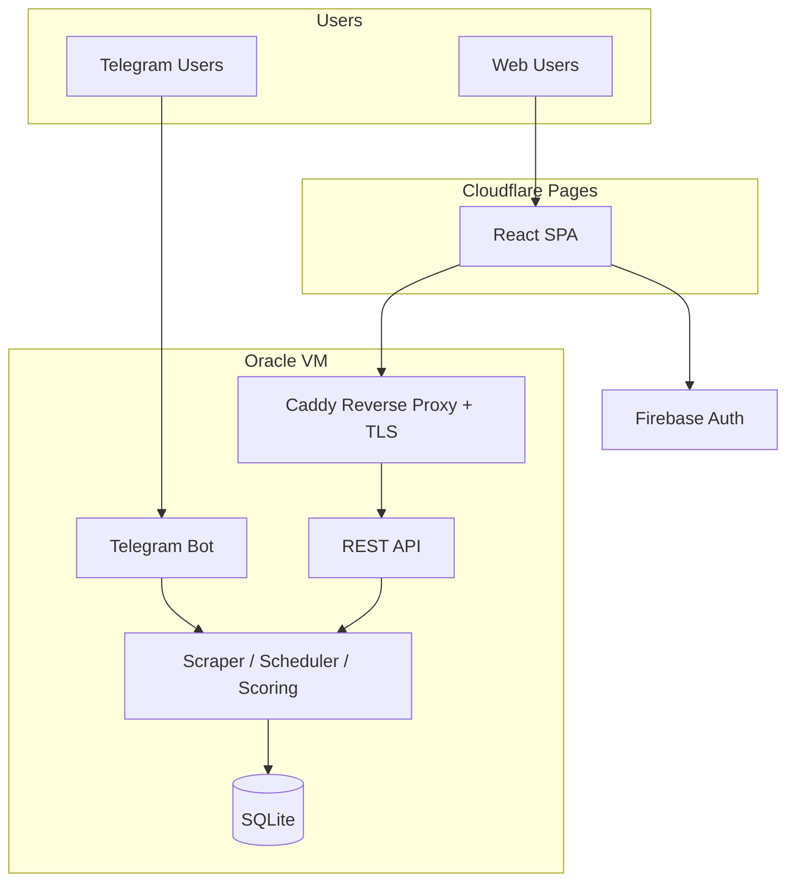

# CarWatch Web Frontend

## Problem Frame

CarWatch currently operates as a Telegram bot. While effective for push notifications, the chat interface is a poor fit for browsing listings, comparing cars, tracking price trends, and managing searches. Israeli car buyers need a visual, responsive web experience where they can see photos, compare options side-by-side, and analyze market data — tasks that are awkward or impossible in a chat window.

The website operates as a standalone product. Users sign up and use it independently — no Telegram account required. Both the bot and the website share the same backend scraping engine and listing data, but users on each channel are independent.

**Terminology:** "Listings" refers to scraped car data objects. "Matches" refers to listings that satisfy a user's search criteria. "Results" is used only as UI terminology (e.g., "results page").

## Requirements

**Authentication**

- R1. Users sign up and log in via Firebase Auth (email/password and Google sign-in). Firebase is used exclusively for authentication — no Firestore, no Firebase Hosting, no other Firebase services.
- R2. The Go backend verifies Firebase ID tokens on every API request using the Firebase Admin Go SDK (`firebase.google.com/go/v4`). A Firebase service account credential file is deployed on the Oracle VM.
- R3. First-time web users get an internal user record created automatically on first authenticated API call. The backend maps the Firebase UID to an internal `chat_id` using the existing `channel`/`channel_id` pattern (same approach as the WhatsApp design): web users get `channel='web'` and `channel_id=<firebase_uid>`, with a synthetic integer `chat_id` in a dedicated range (e.g., `2_000_000_000_000+`). All user data (searches, bookmarks, history) is stored in SQLite, not Firebase.

**Search Management**

- R4. Users create car searches through a guided multi-step form: source (Yad2) → manufacturer → model → filters (price, year, km, engine, hand, keywords)
- R5. The manufacturer and model selection uses the existing catalog system, with search/autocomplete for fast selection
- R6. Users can view, edit, pause, resume, and delete their searches
- R7. Filter controls use sliders and range inputs (not text fields) for numeric values like price, year, and mileage

**Listings Feed**

- R8. Each search has a dedicated results page showing matched listings as visual cards
- R9. Listing cards display: car photo, manufacturer/model, year, price, mileage, hand count, city, deal score badge (color-coded: green for good deals, amber for fair, red for overpriced, with percentage vs. market median), and time since first seen
- R10. Users can sort listings by: newest first, price (low/high), deal score, mileage, year
- R11. Users can filter results client-side within a search (e.g., narrow by city or price sub-range) from already-loaded data
- R12. Server-side pagination for listing results (the backend already supports `limit`/`offset` in storage interfaces)

**Listing Detail**

- R13. Full listing view with cover image displayed prominently. Multi-photo gallery is deferred — the current scraper only captures cover images from the index page, and scraping individual listing detail pages would require a new fetcher capability.
- R14. Price history chart showing how the listing's price changed over time. The `price_history` table stores `(token, price, observed_at)` but the `PriceTracker` interface currently lacks a query method — a new `GetPriceHistory(ctx, token)` storage method is needed.
- R15. Deal score visualization — how this listing's price compares to market median for the same model/year. The existing scoring engine (`internal/scoring`) computes this as a percentage deviation from the median price of the same model/year cohort.
- R16. Fitness score breakdown showing the weighted contribution of each dimension. The existing scoring engine computes this as a weighted score: price 35%, km 25%, hand 20%, year 15%, engine 5%.
- R17. Direct link to the original Yad2 listing

**Comparison**

- R18. Users can select 2–3 listings and compare them side-by-side in a comparison table
- R19. Comparison highlights differences (e.g., cheaper price in green, higher mileage in amber)

**Bookmarks & History**

- R20. Users can save (bookmark) and hide listings
- R21. Saved listings page with server-side pagination
- R22. History page showing past matched listings across all searches, with date and search name, server-side paginated

**Notification Center**

- R23. In-app notification bell with unread badge count. "Unread" is determined by comparing listing `first_seen_at` timestamps against a server-side `last_seen_at` timestamp stored per user, updated when the user opens the notification feed.
- R24. Notification feed shows new matches since the user last opened the feed, grouped by search
- R25. Clicking a notification navigates to the listing detail

**Dashboard (Home)**

The dashboard is a single page with two sections:

- R26. Summary section: active search count, new matches since last visit, best deals across all active searches (by deal score), and a quick-add search shortcut
- R27. Search list section: each search shown with name, match count, last match time, and active/paused indicator

**Market Analytics**

- R28. Analytics page showing trends for car models the user is searching for: average price by model/year, number of listings on market. Historical trend data is computed from `listing_history` and `price_history` tables.

**Design & UX**

*Localization & Layout*
- R29. Hebrew-only interface with full RTL layout

*Responsive Design & Themes*
- R30. Mobile-first responsive design — most users will check on their phones
- R31. Dark mode support

*Visual Polish*
- R32. Loading skeletons and optimistic UI updates for a polished feel

*Image Handling*
- R33. Car cover images displayed on listing cards and detail pages. The `listing_history` table currently lacks an `image_url` column — a schema migration is required to persist cover image URLs from the scraper. Images load from Yad2 CDN directly if possible; if CORS/hotlink-blocked, the Go backend proxies them (with caching).

**Landing Page**

- R34. Public landing page (no auth required) explaining what CarWatch does, with sign-up CTA
- R35. The landing page should showcase the UI quality — this is the first impression

**Network & Deployment**

- R36. The Go backend's HTTP server binds to `0.0.0.0` (currently `127.0.0.1`) with the API port exposed in docker-compose
- R37. A reverse proxy (Caddy recommended — automatic Let's Encrypt TLS) terminates HTTPS in front of the Go API
- R38. CORS middleware on the Go API allows requests from the Cloudflare Pages domain
- R39. A domain name is required for the API endpoint (e.g., `api.carwatch.dev`). Let's Encrypt provides free TLS via Caddy.

## Success Criteria

- A new user can sign up, create a car search, and see matched listings within one polling cycle (~15 minutes, configured via `polling.interval` in config)
- The web experience is materially better than the Telegram bot for browsing and comparing listings
- The website loads fast on mobile (< 3s first contentful paint on 4G)
- Zero impact on existing Telegram bot: bot response latency unchanged, no scheduled polling cycles skipped or delayed, no bot commands removed or changed
- Total infrastructure cost remains $0 (domain name is the only potential cost at ~$10/year)

## Scope Boundaries

- **Not replacing the Telegram bot** — both run simultaneously, independent user bases
- **No account linking** between Telegram and web (deferred to future)
- **No email or push notifications** — in-app notification center only for MVP
- **No real-time updates** — listings refresh on each polling cycle (~15 min), not via WebSocket
- **No admin panel on web** — admin commands stay in Telegram bot
- **No WhatsApp integration on web** — separate initiative per existing brainstorm
- **No user-to-user features** — no sharing, no social, no comments
- **No multi-photo gallery** — cover image only until a listing detail scraper is built
- **REST API design is deferred to planning** — ~15-20 endpoints covering searches, listings, bookmarks, history, notifications, catalog, and analytics

## Key Decisions

- **React + Vite + TypeScript + Tailwind + shadcn/ui**: Industry-standard stack for beautiful, interactive web apps. Component ecosystem enables the polish level we're targeting.
- **Cloudflare Pages for hosting**: Unlimited bandwidth on free tier. Best free hosting option — Vercel prohibits commercial use, Firebase Hosting has 360 MB/day limit, Netlify's credit system is unpredictable.
- **Firebase Auth only**: Provides Google sign-in and email/password with zero frontend auth code. Free up to 50K MAU. The only Firebase service used — all data stays in SQLite.
- **SQLite stays**: No migration to Firestore. The Go backend already has a mature storage layer. Web frontend accesses data through the REST API, not directly. SQLite WAL mode supports concurrent reads; write contention between the API and scheduler is acceptable at this scale (single-writer with 5s busy timeout).
- **Shared backend, independent frontends**: One Go binary serves both the Telegram bot and the REST API. Same scraper, same database. Users on each channel are independent — no cross-notification.
- **Web user identity via channel/channel_id pattern**: Reuses the WhatsApp design from the existing brainstorm. Web users get synthetic integer `chat_id` values in the `2_000_000_000_000+` range, avoiding conflicts with Telegram IDs and WhatsApp IDs (`1_000_000_000_000+`).
- **Hebrew only**: Primary audience is Israeli car buyers. Simplifies layout and copy. English can be added later using the existing locale system.
- **Caddy for TLS**: Automatic Let's Encrypt certificates, zero-config HTTPS reverse proxy. Runs alongside the Go backend on the Oracle VM.

## Dependencies / Assumptions

- Oracle VM has sufficient resources for Caddy + Go API alongside the existing bot and scheduler
- A domain name is available (or will be purchased) for the API endpoint
- Firebase service account credential file can be securely deployed on the Oracle VM
- Firebase Auth free tier (50K MAU) is sufficient for projected user base
- Cloudflare Pages free tier remains stable
- SQLite write contention remains manageable at projected user scale

## Outstanding Questions

### Deferred to Planning

- [Affects R33][Needs research] Can Yad2 cover images be loaded directly in the browser, or do they require a backend proxy due to CORS/hotlink restrictions?
- [Affects R14][Technical] What charting library to use for price history visualization (recharts, chart.js, etc.)?
- [Affects R4][Technical] How to structure the REST API endpoints — resource-based REST is likely, but exact resource design needs codebase exploration
- [Affects R28][Technical] How to efficiently compute market analytics — on-the-fly queries from `listing_history`/`price_history` vs. materialized aggregation table updated by the scheduler
- [Affects R33][Technical] Schema migration strategy for adding `image_url` to `listing_history` and backfilling existing records

## Next Steps

-> `/ce:plan` for structured implementation planning
